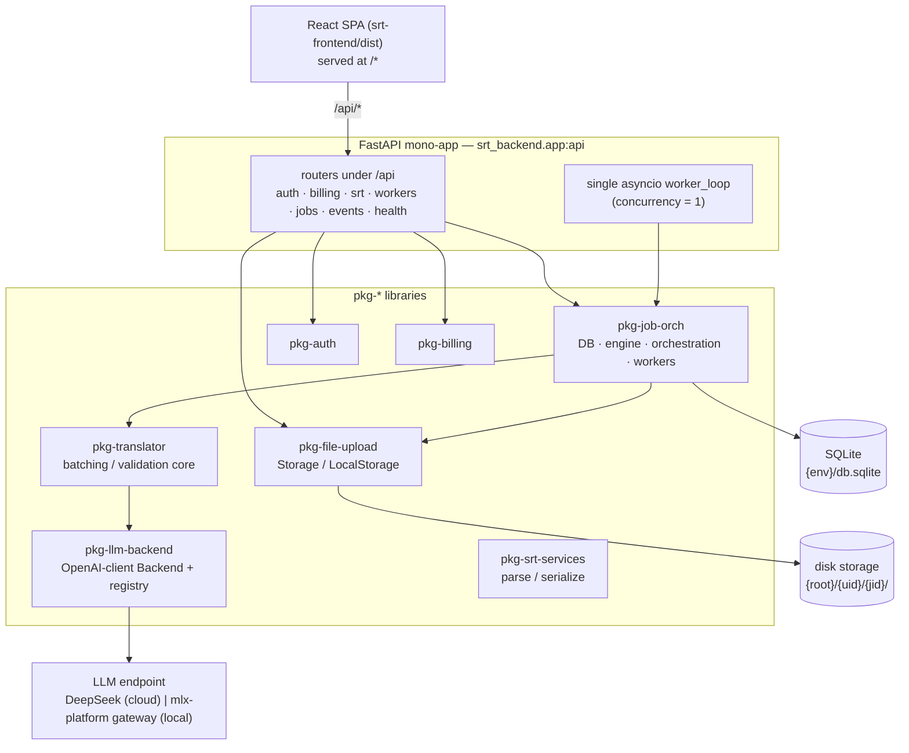

# 01 — System Architecture

srt-flow is a web app for translating SubRip (`.srt`) subtitle files: a user
uploads an `.srt`, picks a source language and one or more target languages,
and gets back one translated `.srt` per target. The system is a single FastAPI
process that imports every backend capability as an in-repo `pkg-*` library,
runs translation in-process against a configurable LLM backend registry, and
serves the built React SPA from the same origin.

This document owns the top-level shape: workspace layout, app wiring, the DB
and storage layers, the translation engine, notifications, and deploy/ops. It
defers subsystem internals to their own docs (referenced inline). Everything
here is present tense and verified against the code as it stands.

---

## Topology at a glance

One uvicorn process per environment. It imports all `pkg-*` packages as
libraries, mounts their routers under `/api`, runs a single in-process asyncio
job worker, and serves the prebuilt frontend at `/*`.



Reference: `srt-backend/DESIGN.md` (prototype design) and
`docs/plans/MLX_PLATFORM_MIGRATION.md` / `docs/plans/PHASE_B_HANDOFF.md`
(the migration that folded the standalone worker services into this process).

---

## Monorepo / workspace layout

Two independent projects at the repo root:

- **`srt-backend/`** — a **uv workspace**. Its `pyproject.toml` declares the
  app package (`srt-backend`, code under `src/srt_backend/`) and lists every
  `pkg-*` as both a dependency and a `[tool.uv.workspace]` member resolved via
  `[tool.uv.sources] … { workspace = true }`. `uv sync` installs the app plus
  all members editable into one `.venv`.
- **`srt-frontend/`** — a separate Vite + React + TypeScript npm project.

The **repo root** is *not* itself a uv workspace; its `pyproject.toml` only
holds shared Ruff config, which every package inherits by upward discovery.

Workspace members (`srt-backend/pyproject.toml`):

| Member | Public boundary | Role |
|---|---|---|
| `pkg-auth` | `pkg_auth.api` | Google OAuth + dev bypass, `get_current_user` (see `02-auth.md`) |
| `pkg-billing` | `pkg_billing.api` | Stripe checkout/webhooks (see `03-billing.md`) |
| `pkg-file-upload` | `pkg_file_upload.api` | `Storage` artifact layer |
| `pkg-job-orch` | `pkg_job_orch.api` | DB engine, migrations, models, orchestration, worker registry, job routes |
| `pkg-llm-backend` | `pkg_llm_backend.api` | One OpenAI-client LLM backend + `LLM_BACKENDS` registry |
| `pkg-notification` | `pkg_notification.api` | Notification package (currently a stub — see below) |
| `pkg-srt-services` | `pkg_srt_services.api` | Pure SRT parse/serialize (see `05-srt.md`) |
| `pkg-translator` | `pkg_translator.api` | Translation batching/validation core |

**Package contract rule** (enforced by each package's `AGENTS.md`): packages
import each other only through `api.py`; the package root is never a public
surface. Interfaces are `Protocol` types. Library code has no import-time side
effects and never writes to stdout/stderr.

---

## FastAPI app wiring

File: `srt-backend/src/srt_backend/app.py`.

`_create_app()` builds the `FastAPI(title="srt-flow")` instance and mounts
every package router under `/api` in this order: auth, health, billing, srt,
workers, jobs, events (`app.py:_create_app`). The `/api` prefix reserves `/*`
for the SPA so the static fallback never collides with the API.
`register_admin(app)` mounts the SQLAdmin console at `/admin`, and an
`X-Robots-Tag: noindex` middleware covers admin URLs.

Two wiring details worth noting:

- **Auth override**: `app.dependency_overrides[require_job_user] =
  get_current_user` — `pkg-job-orch` declares an abstract `require_job_user`
  dependency and the app binds it to the real `pkg-auth` implementation, so
  job-orch stays independent of auth internals.
- **Store injection**: the lifespan constructs one `AppStore(database_url)`
  (`srt_backend/app_store.py`, a DB-backed `UserStore`+`BillingStore`) and
  hands it to `set_user_store` / `set_billing_store`.

### Lifespan (startup/shutdown)

`lifespan()` (`app.py:lifespan`) runs on startup, in order:

1. Build a `JobContext` (`_build_ctx`) carrying the asyncio `queue`, a
   `LocalStorage` rooted at `STORAGE_ROOT`, the dev user id, a `NullNotifier`,
   the free-tier limit, and the bilingual detector.
2. `run_migrations(database_url)` — `alembic upgrade head`.
3. `seed_dev_user()` (idempotent).
4. **Recover-scan**: `recover_jobs()` resets any `processing` rows back to
   `pending`, then `enqueue_pending()` replays every `pending` row onto the
   volatile queue. Durable rows + volatile queue together mean nothing is lost
   across restarts.
5. Start the single `worker_loop` task.

On shutdown it sets the stop event, waits up to 5s for the loop to drain (the
in-flight job is left `processing` and resumes next boot), then resets the
engine cache.

### Static frontend serving

If `srt-frontend/dist` exists, it is mounted last at `/` via `SpaStaticFiles`
(a `StaticFiles` subclass). Behavior:

- Unknown non-`assets/` paths fall back to `index.html` (SPA history routing).
- `/assets/*` (Vite hashed, immutable) get `Cache-Control: public,
  max-age=31536000, immutable`; everything else, including the HTML shell,
  gets `no-cache` so deployments can never mix asset versions.

Same-origin serving means the JWT httpOnly cookie needs no CORS.

---

## Database layer

Owned by `pkg-job-orch`: `pkg_job_orch/db.py` and `migrations/`.

- **One engine per process.** `get_engine(url)` lazily builds and caches a
  single SQLAlchemy `Engine` (module-level `_engine`) with
  `check_same_thread=False` — both the asyncio `worker_loop` and the request
  threadpool touch it, and SQLite serializes its own writes. `reset_engine()`
  is test-only.
- **`session_scope()`** is the standard unit-of-work: commit on success,
  rollback on exception, `expire_on_commit=False` so routes can read
  attributes after the block closes.
- **Migrations** run programmatically via `run_migrations()` → Alembic
  `command.upgrade(..., "head")`, with no `alembic.ini`; the `migrations/`
  directory ships inside the installed wheel so it works regardless of cwd.
  `migrations/env.py` uses `SQLModel.metadata` as the autogenerate target.
  Revisions `0001`–`0010` exist today (initial schema through job failure
  detail). `init_schema()` (create-all from metadata) is a test-only shortcut.
- **Store**: SQLite, one `.db` file per env (`DATABASE_URL`, default
  `sqlite:///./.data/dev/db.sqlite`). Schema is portable to Postgres via the
  same migrations.

Key tables live in `pkg_job_orch/models.py`: `User`, `Job`, `CreditLedgerEntry`
(see `04-credits.md`), `Event` (see `07-analytics.md`), `ProcessedEvent`. Job
status is `pending | processing | done | failed`; a job is one upload → N
targets (`tgt_langs` is a CSV column, no per-target rows). Job lifecycle and
failure classification are detailed in `06-jobs.md`.

---

## Storage layer (`pkg-file-upload`)

File: `srt-backend/pkg-file-upload/src/pkg_file_upload/api.py`. This is a
high-fan-in core: `pkg-job-orch` is its only consumer and never touches disk
directly.

- **`Storage`** is a `runtime_checkable` `Protocol` with `save / get / delete /
  url_for`. Bytes are the unit; SRT text is encoded/decoded by the caller.
- **Derived paths, never caller-chosen.** Every artifact lives at
  `{root}/{user_id}/{job_id}/{filename}`; callers address by *filename only*
  (`input.srt`, `output.<lang>.srt`). `LocalStorage._path` validates every
  component (no `/`, no `.`/`..`) so path layout is enforced in one place and
  traversal is impossible.
- **`LocalStorage`** is the only shipped implementation; the `Protocol` seam
  exists so R2/S3 can drop in later with no caller change. `root` is set at a
  runtime boundary (`LocalStorage(root=...)`), never at import. It also exposes
  `delete_job()` to remove a whole job directory.
- `url_for` returns the relative `{uid}/{jid}/{filename}` identifier — never a
  disk path. Downloads flow through an auth-gated FastAPI route
  (`/api/jobs/{id}/download`); local files are never web-reachable.

Layout under `.data/` (gitignored) for dev; pointed outside the repo
(`~/srt-storage`) in prod so a repo-resetting deploy can't wipe artifacts.

---

## Translation engine

Two packages: `pkg-translator` (the batching/validation core) and
`pkg-llm-backend` (the LLM adapter + registry). Translation runs **in-process**
— there are no separate worker services.

### pkg-translator

Entry point: `pkg_translator.translate_segments`
(`pkg-translator/src/pkg_translator/translator.py`).

- Takes `source_lang`, `targets`, `segments` (`[{id, "<src>": text}]`), a
  `TranslationConfig`, and an `LLMBackend` (a `Protocol`:
  `ensure_model_available` + `generate_text`).
- Resolves the source and each target against the language catalog
  (`load_lang`); unsupported targets are skipped, and an all-unsupported /
  unknown-source run raises `UnsupportedLanguageError`. With no backend wired,
  `NoBackendError` is raised.
- For each target it batches items (`config.batch_size`, with a rolling
  `context_window` of prior source lines) and calls the LLM.
  `_translate_with_split` retries per batch (`max_retries`) and, on persistent
  `ValidationError`, **recursively bisects** the batch down to a single cue —
  a single failing cue is dropped (logged) rather than failing the whole run.
  Output validation lives in `validation.parse_and_validate` (see `05-srt.md`).
- Progress is reported per completed batch via `BatchProgress` /
  `ProgressCallback`.

### pkg-llm-backend

One `Backend` class (`backend.py`) implements the `pkg_translator.LLMBackend`
protocol, delegating to `llm.py`, which is a **single** OpenAI-client
implementation (`from openai import OpenAI`, non-streaming
`chat.completions.create`). All behavioral differences are config, not code:

- `extra_body` (DeepSeek-only, e.g. disable thinking),
- `project` → sends `X-MLX-Project` header for mlx-platform attribution,
- `verify_model_alias` → toggles the `GET /v1/models` reachability check
  (mlx-platform rejects unknown aliases; DeepSeek has no such registry),
- `api_key` (literal, mlx loopback) vs `api_key_env` (read at call time, cloud).

**`LLM_BACKENDS` registry** (`config.py:load_backends`): parses the
`LLM_BACKENDS` env var (comma-separated ids, default `mlx,cloud`) into an
ordered `id → LLMBackendConfig` map. Two builders ship: `mlx` (mlx-platform
gateway, `MLX_PLATFORM_BASE_URL`, batch 10) and `cloud` (DeepSeek,
`DEEPSEEK_API_KEY`, batch 100). `load_backends()` re-reads env on **every call**
(no caching) so tests can `monkeypatch.setenv` and see it immediately. Cloud
deploys set `LLM_BACKENDS=cloud`; local dev/test enables both. Choosing local
vs cloud is thus a config decision, not a separate service.

### How the app drives it

In `pkg-job-orch`, a "worker" is just a registry id. `workers.py` resolves an
id → `LLMBackendConfig` (`worker_backend_config`), lists enabled ids
(`workers_env`), probes reachability (`probe_workers`), and serves the shared
language catalog (`fetch_languages`) — these back `GET /api/workers` and
`GET /api/languages`, whose response shapes are unchanged from the pre-merge
HTTP-proxy era. `orchestration.default_worker_client` runs
`translate_segments` on a worker thread (`asyncio.to_thread`) and folds
`BatchProgress` into a `[0,1]` fraction plus per-target counters written to the
`Job` row.

---

## pkg-notification

`pkg-notification` exists as a workspace member but its public API
(`pkg_notification/api.py`) is currently an empty `__all__` — it ships no
behavior yet. The live notification seam is the **`Notifier` Protocol** and
**`NullNotifier`** defined in `pkg_job_orch/orchestration.py`
(`notify_done` / `notify_failed`). The app wires `NullNotifier()` into the
`JobContext`, so job completion/failure notifications are currently no-ops. A
real provider (email) drops in behind this seam without changing callers.

---

## Request-flow overview

All API routes are under `/api`; the SPA is served at `/*`.

| Step | Route | What happens |
|---|---|---|
| Session bootstrap | `GET /api/auth/me` | current user + tier, or 401 (see `02`) |
| Upload/prepare | `POST /api/srt/parse`, `POST /api/srt/prepare` | decode + parse `.srt` → cues, bilingual detection (rate-limited; see `05`) |
| Discovery | `GET /api/workers`, `GET /api/languages` | enabled backend ids + health; language catalog |
| Create job | `POST /api/jobs` | quota/credit pre-check → `clean_target_langs` → `serialize` cues → `Storage.save(input.srt)` → INSERT `Job(pending)` → `queue.put` → `202 {job_id}` |
| Worker | in-process `worker_loop` | claim `pending` → `processing` → `translate_segments` via backend → `Storage.save(output.<lang>.srt)` per target → `done` (debit credits) or classified `failed` |
| Poll | `GET /api/jobs`, `GET /api/jobs/{id}` | list / status + per-target progress + ETA |
| Retry | `POST /api/jobs/{id}/retry` | re-enqueue a failed job (see `06`) |
| Download | `GET /api/jobs/{id}/download` | auth-gated stream of output artifact(s) |

The worker path is: `worker_loop` → `_process_job` (claim, `attempts += 1`) →
`_run_translation` (`Storage.get(input.srt)` → `parse` → `build_segments` →
`default_worker_client`) → `_land_results` (write outputs, flip `done`, debit
credits, record `job_completed` event) — all in `orchestration.py`. Failures
are classified (`_classify_backend_error` → `JobErrorKind`) and persisted with
debug detail; the loop itself never dies. Details of lifecycle, failure kinds,
credit debit, and event emission belong to `06-jobs.md`, `04-credits.md`, and
`07-analytics.md`.

**Concurrency invariant**: exactly one `worker_loop` per process, pulling one
job at a time. SQLite's single writer and the backend's single-threaded local
model both require it.

---

## Deploy / ops

- **Local dev**: `make dev` runs backend (`:19205`) + frontend (`:19105`)
  concurrently. `make serve` runs the deployment topology (FastAPI serving the
  prebuilt `dist`). `make check` mirrors CI (Ruff lint+format, pyright, pytest,
  frontend prettier/eslint/typecheck/tests, frontend build). `make install`
  runs `uv sync` + `npm install`; `make hooks` installs the pre-push hook that
  runs `make check`.
- **CI** (`.github/workflows/ci.yml`): parallel jobs — `ruff` (single repo-wide
  run), `backend` (uv sync + pyright + pytest, with `ENV=dev AUTH_MODE=dev` and
  **no** LLM creds, so tests use a fake `LLMBackend` and never hit a live
  endpoint), standalone `pkg-translator` and `pkg-llm-backend` jobs, and
  `frontend` (format/lint/typecheck/test/build). CI is test-only; it does not
  deploy.
- **Deploy** (manual): both environments live on one Mac as separate git clones
  on their branch (`srt-flow-prod` → `main`, `srt-flow-staging` → `staging`).
  To ship a revision, `git pull --ff-only` the clone and restart the matching
  **brbot-router** project (`srt-flow` / `srt-flow-stg`) via the dashboard or
  `POST /api/projects/<project>/{stop,start}`. Start runs `make build &&
  make serve`, so the restart rebuilds the frontend and serves the new commit;
  Alembic migrations apply at app startup via the lifespan. See `ops/README.md`.
- **Router / tunnel** (`ops/`): brbot-router runs as a launchd agent
  (`ops/launchd/…plist`) and fronts the app via Cloudflare
  (`staging.srt-flow.com`, `app.srt-flow.com`); projects share an `mlx`
  resource group so an authenticated `start` atomically preempts others. The
  router passcode is read from machine-local config, never stored in GitHub.
  Setup is documented in `ops/README.md`.

---

## Known gaps

- **`pkg-notification` is a stub.** Job done/failed notifications are no-ops
  (`NullNotifier`); no email/provider integration ships yet.
- **Single SQLite writer.** The design is deliberately one worker / one writer;
  scaling concurrency requires the documented move to Postgres.
- **Prototype auth in deployed envs.** Per `ops/README.md`, the deployed sites
  currently run `ENV=dev`/`AUTH_MODE=dev`; switching to Google auth is required
  before treating either public site as true production (see `02-auth.md`).

---

## Package map

| Package | Responsibility | Key entry symbols |
|---|---|---|
| `srt-backend` (`src/srt_backend`) | App factory, lifespan, router mounts, SPA serving | `app.py:_create_app`, `app.py:lifespan`, `app.py:SpaStaticFiles`, `app_store.py:AppStore` |
| `pkg-file-upload` | On-disk artifact storage behind a `Protocol` | `api.py:Storage`, `api.py:LocalStorage` |
| `pkg-job-orch` (db) | Single engine, sessions, Alembic migrations | `db.py:get_engine`, `db.py:session_scope`, `db.py:run_migrations` |
| `pkg-job-orch` (orch) | Enqueue, worker loop, recovery, worker registry | `orchestration.py:enqueue`, `orchestration.py:worker_loop`, `orchestration.py:default_worker_client`, `orchestration.py:JobContext`, `workers.py:worker_backend_config` |
| `pkg-translator` | Batching, retry/bisect, validation core | `translator.py:translate_segments`, `translator.py:LLMBackend` |
| `pkg-llm-backend` | One OpenAI-client backend + `LLM_BACKENDS` registry | `backend.py:Backend`, `llm.py:generate_text`, `config.py:load_backends`, `config.py:LLMBackendConfig` |
| `pkg-notification` | Notification package (stub today) | `pkg_notification.api` (empty); live seam: `orchestration.py:Notifier`, `NullNotifier` |
| `pkg-srt-services` | Pure SRT parse/serialize (see `05`) | `api.py:parse`, `api.py:serialize`, `api.py:split_bilingual` |
| `pkg-auth` | Auth / session (see `02`) | `pkg_auth.api:get_current_user` |
| `pkg-billing` | Billing / Stripe (see `03`) | `pkg_billing.api:router`, `set_billing_store` |
```
