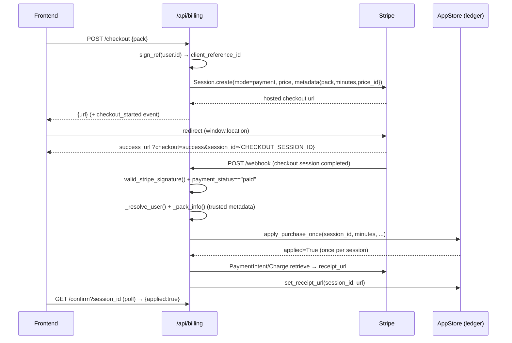

# 03 — Billing (money-in)

Billing is a **credit-pack** model: users buy non-expiring minute packs through
Stripe Checkout, and a paid webhook credits their balance exactly once per
Checkout Session. Purchases, refunds, and disputes all land as rows in the
append-only credit ledger, and the account/billing page reads that ledger back
for balance, usage, and transaction history. This doc covers money-in (Stripe
purchases, refunds, disputes) and the billing UI; the ledger data model and
per-job debiting live in [04-credits-metering.md](./04-credits-metering.md).

## Architecture

The billing router is `pkg_billing.api.router` (`pkg-billing/src/pkg_billing/api.py:router`),
mounted under `/api` in the mono-app (`srt-backend/src/srt_backend/app.py:167`),
so all routes below are served at `/api/billing/*`. Persistence goes through the
`BillingStore` Protocol (`pkg-billing/src/pkg_billing/store.py:BillingStore`),
implemented by the shared `AppStore` (`srt-backend/src/srt_backend/app_store.py:AppStore`)
against the `pkg-job-orch` DB. Config is env-loaded and validated into an
immutable `BillingConfig` (`pkg-billing/src/pkg_billing/config.py:BillingConfig`).

## Packs

Two packs, mapped from **trusted Stripe price metadata** — never client input.
The canonical minute values live in `PACK_MINUTES` (`pkg-billing/src/pkg_billing/api.py:PACK_MINUTES`).

| Pack | Minutes | Price (USD) | Stripe price env |
|------|---------|-------------|------------------|
| `small` | 100 | $3.99 | `STRIPE_SMALL_PRICE_ID` |
| `large` | 1000 | $29.99 | `STRIPE_LARGE_PRICE_ID` |

Free logged-in allowance is `free_tier_monthly_limit` (default **30 min/month**,
`config.py:BillingSettings`, env `FREE_TIER_MONTHLY_LIMIT`); prices in the tables
above are UI copy, not enforced server-side (Stripe owns the amount). Purchased
minutes are additive and never expire — see 04 for balance/metering semantics.

Checkout requires the four Stripe fields set **together** — `STRIPE_SECRET`,
`STRIPE_SMALL_PRICE_ID`, `STRIPE_LARGE_PRICE_ID`, `APP_BASE_URL`
(`config.py:get_config` cross-validation); a partial set raises `RuntimeError`.
`STRIPE_WEBHOOK_SECRET` is separate and only asserted by the webhook route, so a
checkout-only deploy can omit it.

## Endpoints

All under `/api/billing`. Auth is `get_current_user` except `/webhook` (verified
by Stripe HMAC signature).

| Method | Path | Purpose | Code |
|--------|------|---------|------|
| `GET` | `/balance` | Balance snapshot for the UI (free + purchased) | `api.py:get_balance` |
| `GET` | `/history?limit=&before=&category=` | Ledger page (keyset cursor, category filter) | `api.py:get_history` |
| `GET` | `/confirm?session_id=` | `{applied: bool}` — has this session been credited for this user | `api.py:confirm_purchase` |
| `POST` | `/checkout` | Create a Checkout Session, return hosted `{url}` | `api.py:checkout` |
| `POST` | `/webhook` | Stripe event ingestion (signature-verified) | `api.py:webhook` |

`POST /checkout` takes `{pack: "small"|"large"}` (default `small`,
`api.py:CheckoutRequest`), builds the session via `create_checkout_session`,
records a `checkout_started` analytics event (`app_store.py:record_checkout_started`,
intent, no dedup), and returns the hosted URL. Missing Stripe config surfaces as
**503**.

## Checkout → webhook → credit flow

### Session creation

`create_checkout_session` (`api.py:create_checkout_session`) resolves the pack's
price id, signs the user id into an HMAC `client_reference_id`
(`signing.py:sign_ref`), and calls `_create_checkout_session_sync`
(`api.py:_create_checkout_session_sync`) in a threadpool. The session is
`mode="payment"` (one-time, no subscriptions), `quantity=1`, with
`metadata={pack, minutes, price_id}`. `success_url` embeds Stripe's literal
`{CHECKOUT_SESSION_ID}` placeholder (written doubled in the f-string) so the
frontend can confirm the specific session on return. Stripe API errors are
masked as a `RuntimeError("Stripe checkout is temporarily unavailable")`.

### Webhook

`POST /webhook` (`api.py:webhook`) reads the raw body, requires
`webhook_secret`, and rejects a bad/missing signature with **400** via
`valid_stripe_signature` (custom HMAC-SHA256 with a 300s tolerance,
`signing.py:valid_stripe_signature`). Parsed events dispatch through
`_handle_event` (`api.py:_handle_event`), which ignores anything outside
`SUPPORTED_EVENT_TYPES`:

- `checkout.session.completed`
- `checkout.session.async_payment_succeeded`
- `refund.created`
- `charge.dispute.created`
- `charge.dispute.funds_reinstated`

For paid sessions it requires `payment_status == "paid"`, resolves the user
(`_resolve_user`: verify the signed `client_reference_id`, else fall back to a
**unique** email match — ambiguous/absent matches are dropped with a warning),
then extracts pack info.

### Trusted pack metadata

`_pack_info` (`api.py:_pack_info`) reads pack/minutes from the expanded
line-item **price metadata** (falling back to session metadata), and only
returns a pack when **all** hold: `pack in PACK_MINUTES`, `minutes` equals
`PACK_MINUTES[pack]`, **and** `price_id` equals the configured price for that
pack. This makes the credited amount depend on server-trusted Stripe data, not
anything a client could forge. A session without trusted metadata (or missing
`amount_total`/`currency`) is logged and ignored.

## Ledger entries for money-in

Each money-in event appends a `CreditLedgerEntry` (schema/fields in 04). The
kinds relevant here, with their idempotency keys:

| `entry_type` | Direction | Idempotency key | Written by |
|--------------|-----------|-----------------|------------|
| `purchase` | + minutes | `purchase:{session_id}` (+ `ProcessedEvent` unique on `event_id` & `session_id`) | `app_store.py:apply_purchase_once` |
| `refund` | − minutes (proportional) | `refund:{refund_id}` | `app_store.py:apply_refund_once` → `_apply_reversal` |
| `dispute` | − minutes (full pack) | `dispute:{dispute_id}` | `app_store.py:apply_dispute_once` → `_apply_reversal` |
| `dispute_reinstated` | + minutes (reverses the dispute) | `dispute_reinstated:{dispute_id}` | `app_store.py:apply_dispute_once` |

(`job_debit` — per-job usage — is doc 04.)

### Crediting a purchase

`apply_purchase_once` (`app_store.py:apply_purchase_once`) is keyed on the
**Checkout Session ID**, per Stripe's fulfill-once-per-session guidance. In one
transaction it inserts a `ProcessedEvent` (unique on both `event_id` and
`session_id`, `models.py:ProcessedEvent`), appends the `purchase` ledger row
(`idempotency_key="purchase:{session_id}"`, `created_at` = Stripe event time via
`_paid_at`), increments `user.purchased_minutes`, and records a deduped
`purchase_completed` analytics event. Any `IntegrityError` (duplicate session or
event) rolls back and returns `False`, so a re-fired webhook is a safe no-op.

`_handle_event` only enriches the receipt **after** the purchase is committed:
if crediting returned `True` it calls `_fetch_receipt_url_sync` best-effort in a
threadpool and writes the URL via `set_receipt_url`.

### Refunds & disputes (reversals)

`_apply_reversal` (`app_store.py:_apply_reversal`) finds the original `purchase`
by `payment_intent_id` (else `charge_id`, `_find_purchase`), computes minutes to
reverse, and posts a **negative** entry:

- **Refund**: proportional — `ceil(amount_cents / purchase.amount_cents ×
  purchase.minutes_delta)`. Keyed by Refund ID, so partial and repeat refunds
  each post once.
- **Dispute created**: reverses the full pack (`amount_cents=None`). Keyed by
  dispute ID.
- The reversal is capped so cumulative reversals for a purchase never exceed the
  minutes originally credited (`min(requested, purchase minutes − net already
  reversed)`), preventing double-reversal when a charge is both refunded and
  disputed.
- **Dispute reinstated** (`funds_reinstated`): looks up the prior
  `dispute:{dispute_id}` row and posts an equal **positive** `dispute_reinstated`
  entry; a no-op if the original dispute row is absent.

Reversing already-consumed credit can drive `purchased_minutes` negative — a
designed outcome that blocks new jobs until the balance recovers (enforcement
detailed in 04).

`apply_paid_webhook_once` (`app_store.py:apply_paid_webhook_once`) is a
deprecated binary-tier helper retained only for API compatibility; the live path
is `apply_purchase_once`.

### Receipt enrichment

`_fetch_receipt_url_sync` (`api.py:_fetch_receipt_url_sync`) is a **two-step**
Stripe lookup because `receipt_url` lives on the **Charge**, not the
PaymentIntent: retrieve the PaymentIntent with `expand=["latest_charge"]`, then
if `latest_charge` is a bare id string, `Charge.retrieve` it — reading
`receipt_url` off the resolved charge. Every Stripe call passes `api_key`. The
URL is stored by `set_receipt_url` (`app_store.py:set_receipt_url`), which
updates the row by its unique `session_id`. Failures are logged and swallowed —
minutes stay credited, `receipt_url` stays null. The `receipt_url` column was
added in migration `0008_ledger_receipt_url`
(`pkg-job-orch/.../migrations/versions/0008_ledger_receipt_url.py`, down-revision
`0007_job_carried_langs`).

## Billing account page — backend

**`GET /history`** (`api.py:get_history`) returns
`{entries, has_more, next_cursor}` using **keyset pagination**, not offset:

- `limit` is bounded `1..100` (default 50) — out-of-range values are rejected
  with FastAPI's automatic **422**.
- The opaque `before` cursor base64-encodes `"<created_at iso>|<id>"`
  (`api.py:_encode_cursor` / `_decode_cursor`; a malformed cursor is **422**).
- Ordering is `(created_at desc, id desc)`; the `id` tie-breaker gives a total
  order so equal timestamps never dup/skip across pages. The query fetches
  `limit + 1` rows to compute `has_more` (`app_store.py:list_ledger`).
- A **base filter** always excludes zero-impact free-tier usage rows
  (`NOT (entry_type=="job_debit" AND minutes_delta==0)`).
- **Category filter** maps to entry-type sets via `CATEGORY_ENTRY_TYPES`
  (`api.py`): `purchases → {purchase}`, `usage → {job_debit}` (paid debits only,
  since the base filter drops the zero ones), `adjustments → {refund, dispute,
  dispute_reinstated}`, `all → no type filter`.
- Each entry DTO carries `id, created_at, entry_type, minutes_delta,
  usage_minutes, balance_after, pack, amount_cents, currency, reason,
  receipt_url`.

**`GET /confirm`** (`api.py:confirm_purchase`) returns `{applied: bool}` via
`has_purchase(user.id, session_id)` (`app_store.py:has_purchase`), scoped by
**both** user and session so it can't leak another user's checkout status. It
backs the frontend post-checkout poll.

**`GET /balance`** (`api.py:get_balance`) returns the balance snapshot the UI
renders (free/purchased/available); its computation is 04's territory.

## Frontend

### Landing pricing section

`LandingScreen.tsx` renders the `#pricing` `<section>` as a data-driven
**3-card grid** (`grid md:grid-cols-3`): Free / Small pack / Large pack. The
large card gets an accent border + "Best value · 25% off" badge. Free CTA →
`primaryAction` (Google login or open app); paid CTAs → `paidAction(pack)` which
calls `startCheckout(pack)` and redirects. When signed in, the Free card shows a
"Current plan" state. A reassurance strip reads "No card for free · one-time
payment · no auto-renew".

`startCheckout(pack)` (`srt-frontend/src/api.ts:startCheckout`) POSTs
`{pack}` to `/api/billing/checkout` and returns `{url}`; the caller sets
`window.location.href = url`.

### Billing screen

`BillingScreen.tsx` (`BillingScreen`) loads `getMe` + `getBillingBalance` +
`getBillingHistory` on mount and renders four regions:

- **`AccountCard`** — email, `TierBadge` (effective tier = "paid" while
  `purchased_minutes > 0`, else account tier), "Member since" from
  `me.created_at`, logout.
- **`UsageCard`** — big `available_minutes` number plus a gradient **`QuotaBar`**
  (`components.tsx:QuotaBar`) over the total pool (free + purchased), and a
  free-this-month / purchased-balance breakdown.
- **Buy minutes** — the small/large pack grid (`startCheckout`).
- **`HistoryTable`** — server-filtered ledger table (Date · Type · Description ·
  Minutes ± · Amount · Receipt) with a category `<select>` (Purchases / All /
  Adjustments) and a "Load more" button. The minutes column shows signed
  `minutes_delta`; `amount_cents` renders via `formatCurrency`; a set
  `receipt_url` becomes a "View receipt" link. Changing the category **replaces**
  rows (drops the cursor, `changeCategory`); "Load more" **appends** the next
  page keyed by `next_cursor` (`loadMore`).

**Post-checkout confirmation.** On the Stripe return, `App.tsx` reads
`checkout=success|cancel` and `session_id` from the URL, stores them in state,
strips both params, and passes them into `BillingScreen` as
`checkoutStatus`/`checkoutSessionId` props (`App.tsx` checkout effect). When the
status is `success` and a session id is present, `BillingScreen` polls
`getBillingConfirm(sessionId)` (`usePoll`, `maxMs: 20_000`, `stopOnError:false`)
until `{applied:true}`, then refetches balance + history. A "Confirming your
payment…" banner shows while polling; a timeout banner tells the user to refresh.

## Known gaps

- **Receipt links are best-effort.** A transient Stripe failure during
  enrichment, or any purchase made before migration `0008`, leaves `receipt_url`
  null and renders no receipt link. There is no backfill or lazy re-fetch.
- **Prices are UI-only.** Pack dollar amounts are hardcoded in the frontend and
  Stripe owns the charged amount; the backend trusts only the *minute* metadata
  and price-id match, not the price value. Changing a Stripe price without
  updating UI copy silently diverges the displayed price.
- **Email-fallback user resolution requires a unique match.** A paid session
  whose signed `client_reference_id` fails to verify and whose email matches zero
  or multiple users is dropped (logged), leaving the purchase uncredited.
- **Balance can go negative** after reversing already-consumed credit; recovery
  is by later purchase or manual ledger adjustment (metering/enforcement in 04).
</content>
</invoke>
