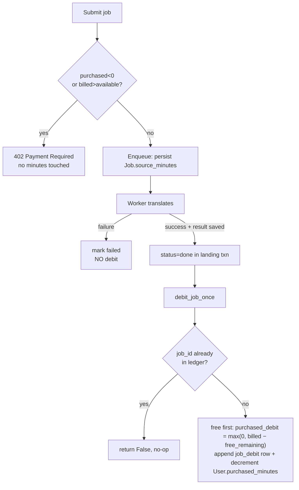

# 04 — Credits & Metering

## Overview

A user's spendable balance is two pools: monthly **free minutes** (derived by
summing metered usage in the current month) and durable **purchased minutes**
(`User.purchased_minutes`). Every credit or usage fact is written as an
append-only row in the `credit_ledger` table; balances are never mutated in
place except for the single denormalized `User.purchased_minutes` counter,
which the ledger always audits. This doc owns the **ledger model** and the
**money-OUT / usage** path (metering and debit-on-success); money-IN
(purchases, refunds, disputes, Stripe) lives in `see 03-billing.md`.

## Data model

### Balance state

- `User.purchased_minutes` — durable integer credit balance, default `0`
  (`pkg_job_orch/models.py:User`). Decremented only by a successful
  `job_debit`; incremented by money-IN entries (see 03).
- Free-tier minutes are **not** stored on the user. They are computed per
  month from the ledger (see Balance computation).

### `credit_ledger` (append-only audit)

`CreditLedgerEntry` → table `credit_ledger` (`pkg_job_orch/models.py:CreditLedgerEntry`).
One row = one credit or usage fact. Rows are inserted, never updated or
deleted — a reversal is a new row (see 03 for refund/dispute rows).

| Column | Type | Notes |
| --- | --- | --- |
| `id` | str (PK) | `uuid4().hex` |
| `user_id` | str (FK `user.id`, indexed) | owner |
| `entry_type` | str (indexed) | kind — see table below |
| `minutes_delta` | int | signed change to `purchased_minutes` (0 when fully covered by free) |
| `balance_after` | int \| None (indexed) | `purchased_minutes` snapshot after this row |
| `usage_minutes` | int | billed minutes consumed (money-OUT only; drives free-tier sum) |
| `usage_month` | str \| None (indexed) | `"%Y-%m"` UTC bucket for free-tier accounting |
| `idempotency_key` | str (**unique**) | dedup key — see kinds table |
| `session_id` | str \| None (**unique**) | Stripe Checkout session (money-IN); see 03 |
| `event_id` | str \| None | source Stripe event (money-IN) |
| `job_id` | str \| None (**unique**) | source job (money-OUT); one debit per job |
| `pack`, `amount_cents`, `currency` | | money-IN purchase detail; see 03 |
| `payment_intent_id`, `charge_id` | str \| None (indexed) | money-IN linkage; see 03 |
| `reason`, `receipt_url` | str \| None | human/audit context |
| `created_at` | datetime (indexed) | server-set |

### Entry kinds

Sign is the direction of `minutes_delta` on `purchased_minutes`.

| `entry_type` | Sign | Idempotency key | Owner |
| --- | --- | --- | --- |
| `job_debit` | − (or 0) | `job:{job_id}` (+ unique `job_id`) | this doc — `credits.py:debit_job_once` |
| `purchase` | + | `purchase:{session_id}` (+ unique `session_id`) | 03 |
| `refund` | − | `refund:{refund_id}` | 03 |
| `dispute` | − | `dispute:{dispute_id}` | 03 |
| `dispute_reinstated` | + | `dispute_reinstated:{dispute_id}` | 03 |

## Metering (money-OUT)

### Source minutes

`credits.py:source_minutes(cues)` = the max cue end timestamp in
milliseconds, rounded **up** to a whole minute, floored at `1`. This is
persisted onto the job as `Job.source_minutes` at enqueue time
(`routes.py:submit` passes `source_minutes=minutes` into `enqueue`;
column `models.py:Job.source_minutes`), so the billed quantity is frozen
against the source at submit and reused at debit time.

### Billed minutes (Option A)

`credits.py:billed_minutes(source_minutes, target_count)` =
`source_minutes × max(1, target_count)`. Each target language is a full
translation pass, so N targets cost N× the source. Carried languages
(`Job.carried_langs`) are pre-supplied and never billed.

## Submit-time balance gate (402)

In `routes.py` the submit handler computes `billed` from `source_minutes`
and the deduped target list, then reads a `BalanceSnapshot`
(`credits.py:balance_snapshot`) and rejects with **402 Payment Required**
when either:

- `balance.purchased_minutes < 0` — a negative purchased balance (e.g. a
  refund/dispute clawed back more than remained) blocks all new work
  regardless of free minutes, or
- `billed > balance.available_minutes` — where
  `available_minutes = free_remaining + purchased_minutes`
  (`credits.py:BalanceSnapshot.available_minutes`).

The 402 body carries `required_minutes` and `available_minutes` for the UI.
This is a **pre-check only** — no minutes are held or deducted at submit.

## Balance computation

`credits.py:balance_snapshot` derives the free pool from the ledger, not a
counter:

- `free_used` = `min(freeSum, free_limit)` where `freeSum` = `SUM(usage_minutes)`
  over `credit_ledger` rows with `entry_type == "job_debit"` and
  `usage_month == <selected month>`.
- `free_remaining` = `max(0, free_limit − freeSum)`.
- `purchased_minutes` is read straight off the `User` row.

`free_limit` defaults to **30** (`orchestration.py` `free_tier_monthly_limit`,
overridable via `app.state`).

## Debit on success only

Minutes are charged **only when a job lands successfully**, never at submit
and never on failure. The worker calls `credits.py:debit_job_once` from
inside the terminal `done` branch of the landing path
(`orchestration.py`, in the `status = "done"` block, same transaction that
persists the result).

`debit_job_once` (`credits.py:debit_job_once`):

1. Returns `False` immediately if any ledger row already has this `job_id`
   (re-entry guard).
2. Recomputes `billed = billed_minutes(job.source_minutes, len(targets))`
   using the job's persisted `source_minutes` and its target CSV.
3. Consumes the month's **free** minutes first:
   `purchased_debit = max(0, billed − free_remaining)`.
4. Appends one `job_debit` row (`minutes_delta = −purchased_debit`,
   `usage_minutes = billed`, `usage_month`, `idempotency_key = job:{id}`,
   `job_id`) and decrements `User.purchased_minutes` by `purchased_debit`
   in the same session.
5. Emits a keyed `credits_debited` analytics event (deduped on the ledger
   row id) and returns `True`.

Because free minutes are absorbed before purchased minutes, a fully
free-covered job writes a `job_debit` row with `minutes_delta = 0` but a
non-zero `usage_minutes` (so it still counts against the monthly free cap).

## Why append-only + idempotency keys

- **Append-only** makes the ledger an auditable history: current balance is
  reconstructable by replaying rows, every charge/credit is attributable to
  a source (`job_id`, `session_id`, `payment_intent_id`), and a reversal is
  a new signed row rather than an in-place edit that would erase evidence.
- **Idempotency keys prevent double-count.** The unique `idempotency_key`
  column (plus the dedicated unique `job_id` for debits and unique
  `session_id` for purchases) means a retried worker landing, a redelivered
  webhook, or a duplicate enqueue can attempt the same insert but the second
  write violates the unique constraint. `debit_job_once` layers an explicit
  `job_id` existence check on top so a retry is a cheap `False` rather than a
  caught integrity error — at-most-once debit per job, at-most-once credit
  per Stripe session.

## Known gaps

- The 402 gate is advisory, not a reservation: nothing debits at submit, so
  concurrent submissions can each pass the check and a later job can debit
  into a negative `purchased_minutes` (bounded by the next submit's
  `purchased_minutes < 0` block). Free minutes are month-bucketed by
  `Job.created_at`, so a job created just before a month boundary meters
  against the creation month.
- Free-tier usage is derived from `job_debit` rows only; it has no
  standalone per-user reset record — the month rolls purely by
  `usage_month` string.
