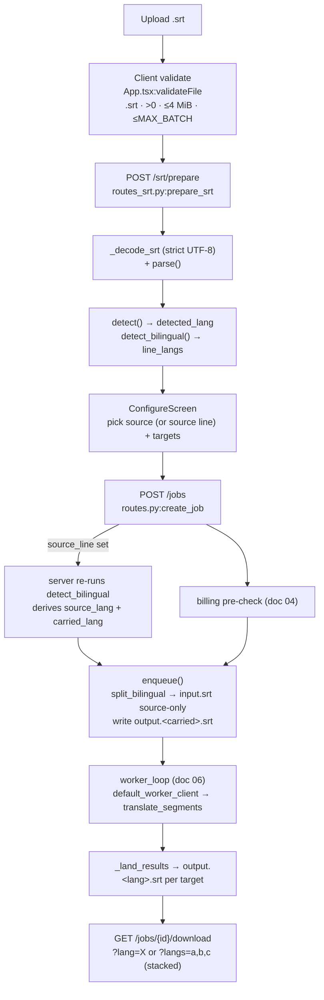

# 05 — SRT Processing: Parse, Language Detection, Translation Pipeline

SRT files move through four server stages — **parse/validate**, **prepare/detect** (source-language + bilingual detection), **translate** (in-process LLM run), and **download** (per-language or stacked). Parsing and serialization are pure and network-free (`pkg-srt-services`); detection is Lingua-backed and lives in the host app; translation runs in-process on a worker thread against the LLM backend layer. Bilingual uploads are modelled as one billed **source language** plus one unbilled **carried language** that is split out at enqueue and carried through to the stacked download.

Related docs: LLM backend infra → **01**; credits/billing → **04**; job lifecycle & failure handling → **06**. This doc references those, it does not restate them.

## Flow

## Stage 1 — Parse & validate

Pure SubRip parsing lives in `pkg_srt_services.api`; the public surface is `api.py` only (`pkg-srt-services/AGENTS.md`).

- **Cue model**: `pkg_srt_services.api:Cue` — frozen `{index:int, start:str, end:str, text:str}`. Timestamps are kept as their raw SubRip strings so `serialize(parse(s))` round-trips; `text` preserves internal newlines, strips surrounding whitespace.
- **`parse`** (`pkg_srt_services.api:parse`): tolerates a leading BOM, normalizes CRLF/CR → LF, splits blocks on one-or-more blank lines, and parses each via `_parse_block`. Raises `ParseError` on empty payload / no cues.
- **`_parse_block`** (`pkg_srt_services.api:_parse_block`): requires ≥2 lines; line 0 matches `_INDEX`, line 1 matches `_TIMESPAN` (`\d{1,2}:\d{2}:\d{2}[,.]\d{3} --> …`), remainder is the caption body (non-empty required). Any malformed block raises `ParseError` — parsing is **all-or-nothing**.
- **`serialize`** (`pkg_srt_services.api:serialize`): emits canonical SubRip (`,` decimal separator via `_canonical_ts`), blocks joined by a blank line, indices emitted as given (caller owns numbering).
- **HTTP routes** (`srt-backend/src/srt_backend/routes_srt.py`): `POST /srt/parse` (`parse_srt`) returns `{cues, count}`; both routes share `_decode_srt` (extension check → non-empty → ≤4 MiB `_MAX_BYTES` → strict UTF-8) and `_parse_or_400` (maps `ParseError` → 400 at one site). `/srt/parse` is **not** rate-limited; `/srt/prepare` is.

> Note: `parse_and_validate` in `pkg_translator.validation` is unrelated to SRT parsing — it validates **LLM JSON output**, see Stage 3.

## Stage 2 — Prepare & detect

`POST /srt/prepare` (`routes_srt.py:prepare_srt`) does parse + source detection + bilingual detection in one shot, behind a per-client rate limiter (`routes_srt.py:_PrepareLimiter`, `_limit_prepare`): `PREPARE_RATE_LIMIT` (default 20) requests per `PREPARE_RATE_WINDOW_SECONDS` (default 600s), keyed by `_client_key` (trusts `x-forwarded-for` only from `PREPARE_TRUSTED_PROXIES`), 429 + `Retry-After` on breach.

Response: `{cues, count, detected_lang, confidence, bilingual}`.

### Source-language detection

`srt-backend/src/srt_backend/detection.py:detect` — Lingua over a sample of up to `_SAMPLE_SIZE=40` non-empty cue texts, joined into one string.
- Detector (`_get_detector`, `lru_cache`) is built from only the seven mappable Lingua languages (`_LINGUA_LANGS`), so it can never return an unsupported code. `_LINGUA_TO_CODE` maps to worker codes.
- Chinese is split downstream: `hanzidentifier.is_traditional` on the sample → `zh-TW`, else `zh` (`_detect_sample`).
- `detected_lang` is `None` when there is no text, the top guess is unmappable, or top confidence < `_CONFIDENCE_FLOOR=0.5`. `confidence` is still reported. The UI leaves the source unselected in that case.
- Supported set: `detection.py:SUPPORTED_LANGS` = `{en, es, zh, zh-TW, fr, de, ja, ko}` (kept in sync with the workers' `languages.yaml`).

### Bilingual detection

`detection.py:detect_bilingual` returns `pkg_srt_services.api:BilingualDetection(is_bilingual, line_langs, confidence)`. Type alias `BilingualDetector = Callable[[list[Cue]], BilingualDetection]` (also in `api.py`) lets `pkg-job-orch` reference the shape without importing the host app or Lingua.

Algorithm (as implemented):
1. Require ≥ `_BILINGUAL_MIN_CUES=3` cues total.
2. Collect cues whose `text.split("\n")` has **exactly 2** lines. Require the two-line cues to be a **majority** of all cues (`len(two_line) * 2 > len(cues)`) and ≥ `_BILINGUAL_MIN_CUES`.
3. Concatenate **all** line-0 text and **all** line-1 text separately, then run `_detect_sample` on each aggregate (short individual lines rarely clear the floor; aggregating gives context).
4. Bilingual iff both aggregates detect a supported code **and** the two codes differ; `line_langs = [line0_code, line1_code]`, `confidence = min(conf0, conf1)`.

The prepare response exposes `{"line_langs": [...]}` only when `is_bilingual`, else `null`.

## Bilingual handling (source + carried language)

A bilingual upload = one **source language** (translated, billed) + one **carried language** (already present, stored as output, **never billed**). The client is **not trusted** for the languages — it only sends which line the user picked.

- **Request** (`pkg-job-orch/.../routes.py:CreateJobRequest`): `source_lang: str | None`, `source_line: int | None` (`ge=0, le=1`). A model validator requires `source_lang` when `source_line` is `None` (monolingual path unchanged).
- **Server-side derivation** (`routes.py:create_job`): when `source_line` is set, the backend re-runs the injected `ctx.bilingual_detector(cues)` (deterministic — same cues, same result). Missing detector or not bilingual → 400 `"file is not bilingual"`. Otherwise `source_lang = line_langs[source_line]`, `carried_lang = line_langs[1 - source_line]`; any client-sent `source_lang` is overwritten.
- **Target-overlap rejection** (`routes.py:create_job`): after `clean_target_langs`, if `carried_lang in clean_targets` → 400 `"carried language cannot also be a translation target"` (prevents overwriting `output.<carried>.srt` and billing it).
- **Detector injection** (`orchestration.py:JobContext.bilingual_detector`): a `BilingualDetector | None` field mirroring the `worker_client` seam; the host wires `detect_bilingual` in, keeping Lingua out of `pkg-job-orch` and lettting tests inject a fake.
- **Split at enqueue** (`orchestration.py:enqueue`): with a `carried_lang`, `split_bilingual(cues, source_line)` (`pkg_srt_services.api:split_bilingual`) produces source-only cues and carried cues — for each 2-line cue, source text = `lines[source_line]`, carried text = the other; non-2-line cues stay whole in source, omitted from carried. `input.srt` is written **source-only** (so translation and `source_minutes` stay correct downstream), and `output.<carried_lang>.srt` is written immediately.
- **Model + migration**: `pkg-job-orch/.../models.py:Job.carried_langs` — `str` CSV, default `""`, never billed; migration `pkg-job-orch/.../migrations/versions/0007_job_carried_langs.py` adds the column (`server_default=""`). Surfaced as `carried_langs: list[str]` in `get_job` and `Job` dict output.

## Stage 3 — Translation execution

Translation runs **in-process** (no HTTP hop). The job orchestrator's `default_worker_client` (`orchestration.py`) resolves `worker_id` → `LLMBackendConfig` (see doc 01) and calls `pkg_translator.translate_segments` on a worker thread via `asyncio.to_thread`, folding `BatchProgress` into a `[0,1]` fraction for the job's progress. Segments are built by `orchestration.py:build_segments` → `[{id: cue.index, "<src>": text}]`.

`pkg_translator.translator:translate_segments`:
- Config `pkg_translator.config:TranslationConfig` — `batch_size=10`, `context_window=3`, `max_retries=1`, `retry_delay=1.0`, `temperature=0.0`, `max_tokens=2048`; template + `languages.yaml` resolved as package resources.
- Loads source lang config; unknown source → `UnsupportedLanguageError`. Builds `PairConfig` per requested target (deduped, source dropped, unknown targets logged & skipped); no supported pair → `UnsupportedLanguageError`.
- The LLM `backend` (doc 01) is injected; `_RequireBackend` raises `NoBackendError` if none. `ensure_model_available` is called once before translating.
- **`_translate_all`** iterates `batch_size` windows, prepending a `context_window` slice of prior items as untranslated context, emitting a `BatchProgress` per batch.
- **`_translate_with_split`**: on a batch `ValidationError`, recursively splits the batch in half and retries; a single failing item is **dropped** (logged), not fatal — these dropped cues are what `_build_outputs` counts as `dropped_by_target` (doc 06). This means a target's output can be shorter than the source.
- **`_translate_batch`**: builds the prompt, calls the translator, and runs `pkg_translator.validation:parse_and_validate(raw, batch, tgt_code)` — extracts a JSON array (smart-quote-normalized, regex fallback), enforces same length, matching `id`s, and non-empty string translations; retries up to `max_retries` on `ValidationError`.

Returns `(target_codes, merged_segments)`; the orchestrator maps merged segments back onto cues per target and writes `output.<lang>.srt` in `_land_results` (see doc 06 for landing / failure classification).

## Stage 4 — Download

`GET /jobs/{id}/download` (`pkg-job-orch/.../routes.py:download_job`), job must be `done`:
- **Per-language** (`?lang=X`): allowed set `downloadable = {*targets, *carried}`; streams the stored `output.<X>.srt`. Carried languages are directly downloadable.
- **Stacked** (`?langs=a,b,c`): validated against `valid = {source_lang, *targets, *carried}`, deduped, order preserved. Reads source cues from `input.srt`, target/carried text from each `output.<lang>.srt`, and assembles via `pkg_srt_services.api:build_stacked_srt` (stacks languages per cue index in the requested order).
- **Default sets** (`routes.py:get_job`, on `done`): `results` lists `[*carried, *targets]`; `stacked.default_order = [src_lang, *carried, *targets]`.

## Frontend upload/configure UX (`srt-frontend/src`)

- **Batch/validate** (`App.tsx`): `MAX_BATCH = 20` (`App.tsx:81`); `validateFile` enforces `.srt` extension, non-empty, ≤4 MiB; the drop handler caps the selection at `MAX_BATCH` with an "N rejected (maximum 20 files)" message.
- **Parse** (`App.tsx:parseEntry`): calls `prepareSrt`; on a bilingual result, seeds `sourceLang = line_langs[0]` and `sourceLine = 0` (user can flip), otherwise fills `sourceLang` from `detected_lang`. `generation`/`id` guards protect against stale-response races.
- **Configure** (`ConfigureScreen.tsx`): shows detected source + a target picker (up to three). For a bilingual entry it renders a radio group over `bilingual.line_langs` (choose which line is source, `onSourceChange(id, sourceLang, sourceLine)`); `carriedLanguage(entry) = line_langs[1 - sourceLine]` is excluded from selectable targets (backend also rejects overlap) and shown as carried/unbilled. Billing preview counts new targets only (`sourceMetrics.ts`).
- **Create job** (`api.ts:createJob`): sends `source_line` only for the bilingual path (no language codes — backend derives them); `PrepareResponse.bilingual` and `JobStatusResponse.carried_langs` are typed in `api.ts`.
- **Stacked output** (`StackedOutput.tsx`): order key `[sourceLang, ...carriedLangs, ...targetLangs]`, matching the backend `default_order`.

## Known gaps / hardening backlog

These items from `docs/plans/srt-upload-hardening.md` are **not yet implemented** (verified against current code, 2026-07). Listed so they are not lost; everything above describes present behavior.

1. **MAX_BATCH equals the prepare rate limit.** `MAX_BATCH = 20` (`App.tsx:81`) equals the default `PREPARE_RATE_LIMIT = 20` (`routes_srt.py:_limit_prepare`). A full 20-file batch consumes the entire window; any retry/re-upload inside the window → 429 with no client auto-backoff. Fix options: raise the server limit above `MAX_BATCH`, per-file idempotency, or a client queue with backoff on 429.

2. **Strict-UTF-8-only decode.** `_decode_srt` uses `raw.decode("utf-8", errors="strict")` (`routes_srt.py`); non-UTF-8 real-world SRTs (Windows-1252 / Latin-1 / UTF-16) → 400 `"file is not valid UTF-8"`. No charset sniff/fallback (e.g. `charset-normalizer`, which is present in the venv but unused here).

3. **Parser robustness gaps in `pkg_srt_services.api`.** None of the following exist yet:
   - **No timestamp sanity check** — `_TIMESPAN`/`_canonical_ts` validate format only; `start > end`, zero-duration, and out-of-range values (`99:99:99,999`) all pass.
   - **No duplicate/non-sequential index handling** — `_parse_block` accepts any index; `build_stacked_srt` keys target text by `cue.index`, so duplicate indices collide and map the wrong translated line.
   - **No cue-count cap** — `parse` imposes no upper bound on cue count, so 4 MiB of tiny cues → unbounded downstream translation cost/time (detection is bounded at 40 samples; the translate path is not).
   - **No lenient-skip mode** — parsing is all-or-nothing: one bad block (e.g. a missing blank line folding cues together, or an empty-text cue) fails the whole file. No skip-and-warn.
   - **No subtitle-markup handling** — `<i>`, `{\an8}`, ``, etc. are kept verbatim in `text` and translated literally, mangling tags.
