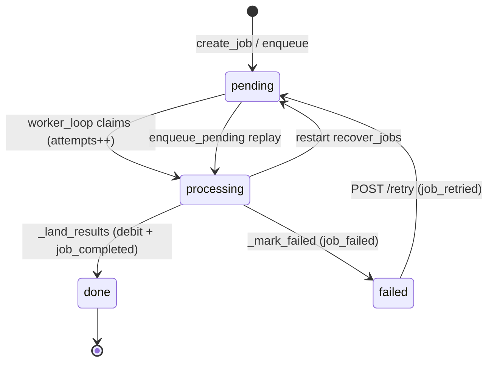

# 06 — Job Orchestration & Failure Handling

One upload → one `Job` → N target languages. A single in-process `worker_loop`
pulls job ids off an in-memory queue, translates each one against its worker's
LLM backend, and lands per-target `output.<lang>.srt` files (or a durable
failure) on the row. Durability lives in the DB rows, not the queue: on restart
the app resets in-flight jobs and replays the backlog, so a crash mid-flight
costs a re-run, never a lost job.

Related: credits / 402 / charge-on-success → doc 04; translation internals
(`translate_segments`, batching) → doc 05; LLM backend resolution → doc 01.

---

## The `Job` row and its states

`Job` (`pkg-job-orch/.../models.py:Job`) is the single durable record. Output
paths are *derived* (`{user}/{job_id}/output.<lang>.srt`), never stored.

| Column | Meaning |
| --- | --- |
| `status` | `pending` \| `processing` \| `done` \| `failed` (`models.py:JobStatus`) |
| `worker`, `src_lang`, `tgt_langs` (CSV), `carried_langs` (CSV) | Replay inputs; `carried_langs` are pre-supplied bilingual text, never billed |
| `progress` (float), `progress_by_target` (JSON) | Aggregate + per-target batch counters |
| `error`, `error_kind`, `error_detail`, `failed_target` | Failure record (see taxonomy) |
| `dropped_by_target` (JSON) | Per-target *soft*-drops on an otherwise-successful job — **distinct** from `failed_target` |
| `source_minutes`, `attempts`, `created_at`/`started_at`/`finished_at` | Billing input + debug |

`error_kind` is a plain `str` TEXT column; its docstring in `models.py:JobErrorKind`
is the single source of truth for the valid values, kept in sync with the
frontend union in `srt-frontend/src/api.ts:JobErrorKind`. The debug columns
`error_detail` + `failed_target` were added in migration
`migrations/versions/0010_job_failure_detail.py` (prod path is Alembic
`upgrade head`; `create_all` is test-only).

---

## Lifecycle: enqueue → process → land

**Enqueue** (`orchestration.py:enqueue`, called from `routes.py:create_job`).
The route runs the 402 pre-check first (doc 04), then in one transaction:
dedup targets via `clean_target_langs` (drops the source if it slipped in,
preserves order), resolve the worker eagerly (unknown worker → `EnqueueError`
→ 404, not a deferred worker crash), serialize source cues → `input.srt` in
storage, `INSERT job(pending)`, record a `job_created` event, and
`queue.put_nowait(job_id)`. The queue is volatile; the row is the durable fact.

**Worker loop** (`orchestration.py:worker_loop`). Exactly one loop per process,
`concurrency=1` — SQLite's single writer and the single-threaded translation
backend both demand it. It polls the queue with a `0.5s` timeout so it stays
responsive to `stop_event`, and a job's exception can never kill the loop (the
inner `_process_job` records the failure; an outer `try/except` is belt-and-braces).

**Process** (`orchestration.py:_process_job`): claim the row (guard
`status == "pending"`, flip to `processing`, set `started_at`, `attempts += 1`,
commit), then `_run_translation`. On success `_land_results`; on failure
`_mark_failed`. Each terminal path notifies via `ctx.notifier`.

**Translate in-process** (`orchestration.py:default_worker_client`). Replaces
the old HTTP/NDJSON hop: resolves `worker_id` → `LLMBackendConfig`
(`workers.py:worker_backend_config`) and runs `pkg_translator.translate_segments`
on a worker thread via `asyncio.to_thread`, feeding a `fold_progress` callback.
A `WorkerResolutionError` here becomes `WorkerStreamError(kind="worker_config")`;
any exception from `translate_segments` is wrapped uniformly with a classified
kind (see taxonomy), the `error_detail`, and the `failed_target` in flight.

**Land** (`orchestration.py:_land_results`): all-or-nothing. Rebuild one
`output.<lang>.srt` per target from the input cues (`_build_outputs`; missing
translations keep the source cue and count toward `dropped_by_target`), write
every file, then in one transaction flip `status=done`, `progress=1.0`, clear
all error fields, `debit_job_once` (doc 04 — **the only debit point**), and
record `job_completed`. Any failure here raises `LandingError` → `_mark_failed`
with `kind="landing"`.

---

## Progress tracking

`default_worker_client.fold_progress` receives a `BatchProgress` per completed
batch and folds them into a `[0, 1]` fraction. The denominator is
**Σ `batch_total` across targets, learned lazily** as each target is first seen
(`batches_total_sum`) — the fraction is `batches_done / batches_total_sum`. It
emits a `ProgressUpdate` (a `float` subclass carrying `by_target`
`{lang: {done, total}}`). `on_progress` (`_run_translation.on_progress`) writes
it to the row: `progress_by_target` JSON + a recomputed aggregate
`progress = Σdone / Σtotal`. Progress writes are guarded (a failed write logs
and is swallowed — it must never kill the job) and only applied while
`status == "processing"`. `get_job` derives per-target `status`
(queued/running/done) and an `eta_seconds` estimate from these counters
(`routes.py:_target_progress`, `_eta_seconds`).

---

## Failure taxonomy

`_classify_backend_error` (`orchestration.py`) maps the raised cause to a kind:
typed causes win, otherwise the message is sniffed for network/timeout/
rate-limit markers (`_BACKEND_UNAVAILABLE_MARKERS`), else the `worker_stream`
catch-all. `internal` (unexpected orchestrator crash) and `landing` are assigned
directly in `_process_job`. `error_detail` = exception class + `repr`;
`failed_target` = the target in flight (hard failure only). Frontend copy lives
in `srt-frontend/src/errorCopy.ts`.

| `error_kind` | Cause | Retryable | User copy (title) |
| --- | --- | --- | --- |
| `backend_unavailable` | `TimeoutError`/`ConnectionError` or network/429/5xx/rate-limit markers in the backend error | yes | "Translation service was temporarily unavailable" |
| `worker_stream` | Catch-all backend/generation failure (default) | yes | "Translation couldn't be completed" |
| `internal` | Unexpected crash in the orchestrator | yes | "Something went wrong on our end" |
| `landing` | Result-persistence failure after translation succeeded | yes | "We couldn't save the results" |
| `unsupported_language` | `UnsupportedLanguageError` — a requested source/target has no catalog entry | **no** | "One of the languages isn't supported" |
| `worker_config` | `NoBackendError` / unknown or misconfigured worker id | **no** | "This translator is unavailable" |

`_mark_failed` writes `status=failed` + all failure columns, sets `finished_at`,
and records a `job_failed` event. It never raises (failures on the failure path
are logged only). Because debit happens only on success, **a failed job is
never charged** — this backs the frontend's "You weren't charged" reassurance.

---

## Retry

`POST /api/jobs/{job_id}/retry` (`routes.py:retry_job`): ownership check, must be
`status == "failed"` (else 409). Resets to `pending`, clears
`error`/`error_kind`/`error_detail`/`failed_target`/`finished_at`/`progress`/
`progress_by_target`, records a `job_retried` event (dedup key
`{job_id}:retried:{attempts}`), commits, then re-queues the id. No re-upload —
`input.srt` is retained. Retries are unlimited; `attempts` increments naturally
on the next claim; billing still only fires on eventual success.

---

## Restart recovery

Startup (`srt-backend/src/srt_backend/app.py:lifespan`) runs migrations, seeds
the dev user, then `recover_jobs` + `enqueue_pending` before starting the loop:

- `recover_jobs` (`orchestration.py`) resets every `processing` row →
  `pending` and clears progress/error fields (an interrupted job is re-run from
  scratch — the in-process worker keeps no partial output). `done`/`failed` rows
  are untouched.
- `enqueue_pending` puts every `pending` id back on the fresh queue (FIFO by
  `created_at`), reconstructing the volatile queue from the durable rows.

Shutdown sets `stop_event` and waits up to 5s; the in-flight job is left
`processing` and recovers on next boot. `test_restart_recovery.py` drives the
real lifespan twice against one DB/storage root: a job hung in `processing` when
session 1 dies reaches `done` after session 2 restarts, and a `done` job stays
done and downloadable.

---

## Events & notifications

Job lifecycle emits keyed (at-most-once) `event` rows via
`events.py:record_event` inside the caller's transaction:
`job_created`, `job_completed`, `job_failed`, `job_retried` — each catalogued in
`events.py:EVENT_CATALOG` with a props whitelist (e.g. `job_failed` carries
`error_kind`). Dedup keys make lifecycle facts idempotent.

Notifications are a **stubbed seam**: `_process_job`/`_land_results` call
`ctx.notifier.notify_done`/`notify_failed`, but the app wires `NullNotifier`
(no-op) and `pkg-notification`'s public API is an empty stub
(`pkg_notification/api.py` exports nothing). No user-facing notification is sent
today.

---

## Frontend job UX

- `errorCopy.ts` maps `error_kind → { title, description, retryable }` with a
  generic retryable `FALLBACK` for unknown/null kinds.
- `App.tsx:FailureCard` renders the friendly title/description, an optional
  "You weren't charged for this job." line (`showNotCharged`), a collapsible
  "Technical details" `
` (kind + `error`/`error_detail`), and a
  **Retry** button only when `copy.retryable` and an `onRetry` is supplied.
  `handleRetryJob` (`App.tsx`) calls `retryJob`, drops the terminal snapshot,
  and remounts the poller so the job transitions failed → processing with no
  re-upload. The same card is reused for non-retryable enqueue failures
  (explicit title/description, no retry).
- `JobsScreen.tsx:FailedDetail` shows the same friendly copy + not-charged line
  inline; `StatusBadge` colors `failed` red (matching the processing-view
  severity), `done` emerald, `processing` accent.

---

## Known gaps

- **Single process, single worker.** One `worker_loop` at `concurrency=1`; no
  horizontal scale. The queue is in-memory (durability is the row + boot replay).
- **No partial-progress resume.** Recovery re-runs an interrupted job from
  scratch; there is no checkpoint of completed targets.
- **Notifications unimplemented.** The `Notifier` seam is wired to `NullNotifier`
  only; `pkg-notification` is an empty stub.
- **Auth is dev-mode.** Routes resolve the owner via `require_job_user`, but the
  seeded dev user owns every job in `AUTH_MODE=dev`.
